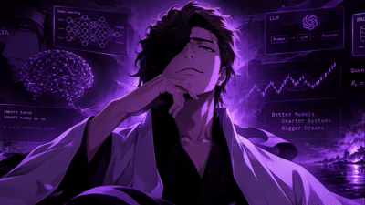

<!--  -->

  

---

## Tools

## STATS

<table>
<tr>
<td align="center" valign="top">

</td>
<td align="center" valign="top">

</td>
</tr>
</table>

## First Principles, Always

I like to understand things from the ground up. Before I use a library, I want to know what it's doing underneath.
That means deriving the math, building models from scratch (linear regression, gradient descent, regularisation) and only then reaching for the framework.

 

**Derive it. Build it. Break it. Then use the library.**

### Built from scratch

| Project | What it covers |
|---|---|
| [ML-models-from-scratch-](https://github.com/coutDG/ML-models-from-scratch-) | Machine learning models implemented by hand, without ready-made libraries doing the work |

 

## Data Pipeline 

